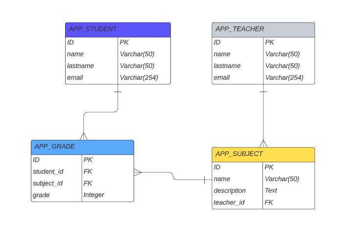

# Preentrega3-Guzman - CODERHOUSE

Aplicación que permite gestionar las calificaciones de los estudiantes. 

## CONSIDERACIONES IMPORTANTES

El sistema permite agregar, Estudiante, Profesor, Matería y Notas. 

- Para agregar Matería tiene que existir al menos un Profesor

- Para Agregar Notas, debe exitir Materias y Alumnos en la base de datos

## CONFIGURACIÓN

1. Crea una carpeta en tu computadora y dento de ésta debes clonar el Repositorio

> `git clone https://github.com/dahguz1980/Preentrega3-Guzman.git`

2. Abre el Visual Studio Code y Abre la Carpeta ***Preentrega3-Guzman***

3. Abre el Archivo requirements.txt dentro de VSCode y presiona el botón "crear entorno".

- Seleccionar el entorno .venv
- Seleccionar la versión de Python 3.11
- Seleccionar el archivo requirements.txt

   Una vez ejecutado se debe crear el entorno virtual .venv 

4. Activar el entorno virtual

> En Windows ejecuta `.\venv\Scripts\activate`

> En Mac o Linux ejecuta `source .venv/bin/activate`

5. Abre el terminal en VSC, verifica que el entorno virtual está activo (.venv) 

> Ejecuta `pip list` y verifica que todas las dependencias están instaladas

6. Ingresa en la carpeta project y ejecuta: 

    ***En Mac cambiar python por python3***

> `python manage.py collectstatic` 
> 
> `python manage.py makemigrations`
> 
> `python manage.py migrate`
> 
> `python manage.py runserver`

## BASE DE DATOS

Base de datos de 4 tablas 

